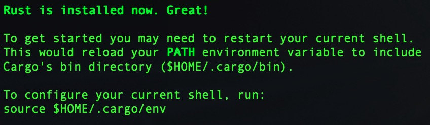

# Hello, rust!

## 0. 学习背景
rust，静态编译型系统级语言，Mozilla 员工 Graydon Hoare 开发的业余项目，设计时集各编程语言之长，安全且可靠。

目前的对语言的一点小体会：

+ 内存安全，在编译阶段把很多指针可能出现的问题都提前暴露出来，不至于留到运行。
+ 无垃圾回收机制，对内存的管理和释放通过 ownership 来实现，以下是一段官网的描述，比较容易理解。
    ```
    Keeping track of what parts of code are using what data on the heap, minimizing the amount of duplicate data on the heap, and cleaning up unused data on the heap so you don’t run out of space are all problems that ownership addresses. 
    ```
+ 语法糖看起来很多，对非 C/C++ 程序员来说，入门还是有点陡峭的。


当然这些都不足以支撑我开坑学一门新语言，最关键的当然是热（很）爱（闲）。

本文将基于[官方文档](https://doc.rust-lang.org/book/title-page.html)来学习，打算开一个系列来记录一些关键知识点和有意思的设计。


## 1. 环境安装

以 MacOS 为例，以下为安装方式，其他 OS，可参考[官网链接](https://doc.rust-lang.org/book/ch01-01-installation.html)

```shell
$ curl --proto '=https' --tlsv1.2 https://sh.rustup.rs -sSf | sh
```

如无特殊需求，安装时选择 1 (default) 即可。

安装完成后，会看到提示如下：
<div  align="center">    
    
</div>

执行 source 命令使环境变量生效。为了后面使用方便，可以将这条命令添加到本地的 shell 配置中（bash -> ~/.bashrc；zsh -> ~/.zshrc）
```shell
$ source $HOME/.cargo/env
```

执行 ```rustc --version``` 看到有版本号输出，即完成安装。

## 2. 编码环境搭建
选一个喜欢的 IDE 或文本编辑器，初学阶段建议 IDE，一些语法提示友好，format 简单，操作容易上手。
这里主要介绍下 Visual Code 下的编程环境搭建。
+ 搜索并下载插件 ```Rust```，用于做语法高亮和提示等。
+ 下载插件 ```Better TOML```，用于做 .toml 文件的高亮。

至此，一个简单的环境就搭建好了，具体怎么搞一个顺手且优雅的环境后面再回来补坑，现在嘛，都是小白，就不误人子弟了。

## 3. hello，world
新建文件 ```hello.rs```
```rust
fn main() {
    println!("Hello, world");
}
```

命令行执行编译。
```shell
$ rustc hello.rs
```

稍等片刻，看到当前目录下生成一个 ```hello``` 的可执行程序，执行可看到 ```Hello, world``` 输出。
```shell
$ ./hello
```

简单讲解，main 是所有程序的入口函数，pringln！是一个 macro，进去可看到其定义和用法注释如下。
```rust
/// Prints to the standard output, with a newline.
///
/// On all platforms, the newline is the LINE FEED character (`\n`/`U+000A`) alone
/// (no additional CARRIAGE RETURN (`\r`/`U+000D`)).
///
/// Use the [`format!`] syntax to write data to the standard output.
/// See [`std::fmt`] for more information.
///
/// Use `println!` only for the primary output of your program. Use
/// [`eprintln!`] instead to print error and progress messages.
///
/// [`std::fmt`]: crate::fmt
///
/// # Panics
///
/// Panics if writing to [`io::stdout`] fails.
///
/// [`io::stdout`]: crate::io::stdout
///
/// # Examples
///
/// ```
/// println!(); // prints just a newline
/// println!("hello there!");
/// println!("format {} arguments", "some");
/// ```
#[macro_export]
#[stable(feature = "rust1", since = "1.0.0")]
#[allow_internal_unstable(print_internals, format_args_nl)]
macro_rules! println {
    () => ($crate::print!("\n"));
    ($($arg:tt)*) => ({
        $crate::io::_print($crate::format_args_nl!($($arg)*));
    })
}
```
这语法乍一看，竟然有点 C++ 和 js 的感觉，确认过眼神是看不懂的样子。

## 4. 进阶版 hello，world
很多语言内置了包和依赖管理工具，方便依赖更新和版本锁定等操作。rust 也不例外，提供了 ```cargo``` 这个工具，且已经随 ```rustc``` 安装到本地。

确定是否安装：
```shell
$ cargo --version
```

创建工程
```shell
$ cargo new hello_world
```

看到屏幕输出如下，即创建成功。
```
Created binary (application) `hello_world` package
```

hello_world 目录结构：
```
.
├── Cargo.toml
└── src
    └── main.rs

1 directory, 2 files
```
其中，src 目录存放源码，外层存放除源码之外的 README / 版权信息等文件。

```Cargo.toml``` 用于保存一些工程的基本信息和依赖信息。其格式大致如下：
```
[package]
name = "hello_world"
version = "0.1.0"
authors = ["w1ue <w1ue@outlook.com>"]
edition = "2018"

# See more keys and their definitions at https://doc.rust-lang.org/cargo/reference/manifest.html

[dependencies]

```

main.rs 的内容与之前一致，在此不再赘述。

运行程序，即可看到 ```Hello, world!``` 输出。
```
$ cargo run
```

若不需运行，只需要二进制程序，则使用 ```cargo build``` 即可生成文件 ```target/debug/hello_world```。

在执行过 cargo 相关的命令编译或运行后，可看到当前目录下出现一个 ```Cargo.lock``` 文件，用于锁定版本号。

关于 Cargo 中更详细的信息，可参考[官网](https://doc.rust-lang.org/book/ch01-03-hello-cargo.html)。

## 5. 简单猜数小程序
官网给出的小例子，用于先感受一下语言，有兴趣的可以看一下，跟着[官网](https://doc.rust-lang.org/book/ch02-00-guessing-game-tutorial.html)的流程一点一点理解，还是蛮有意思的。

程序基础功能如下：

程序随机生成一个数字，用户输入数字，程序给出判断结果（大了，小了或者相等），猜中退出程序。

```rust
use rand::Rng;
use std::cmp::Ordering;
use std::io;

fn main() {
    println!("Guess the number!");

    let secret_number = rand::thread_rng().gen_range(1..101);

    loop {
        println!("Please input your guess.");

        let mut guess = String::new();

        io::stdin()
            .read_line(&mut guess)
            .expect("Failed to read line");

        let guess: u32 = match guess.trim().parse() {
            Ok(num) => num,
            Err(_) => continue,
        };

        println!("You guessed: {}", guess);

        match guess.cmp(&secret_number) {
            Ordering::Less => println!("Too small!"),
            Ordering::Greater => println!("Too big!"),
            Ordering::Equal => {
                println!("You win!");
                break;
            }
        }
    }
}
```

这段程序里面有些用法看起来还是蛮有意思的，比如 match 这个关键字的用法，似乎透着那么一丝高级，有点工厂又有点函数编程的意思。

官网文档过了一小部分，对 rust 这门语言有点兴趣，后面会持续更新的～（认真脸）
